----
**2A SEM/SGB**
*30/05/2022*
----
*Redacted by :*
* JOHANSSON Markus
* MELLIER Sam
* PONS Victoria 
* ROBERT Clément
----

# **UE SMART CITIES**

## **Dynamic Models for Building Energy Management**

# **Introduction**

The building sector is an energy consuming sector. It will then be very important to succeed in reducing the energy consumed by the buildings and to do this there are several parameters to take into account such as the geometry of the building and the materials which constitute it. The study made during these three sessions consists in the estimation of the energy efficiency of a smart home by modeling and simulation.

The plan for the three sessions can be found below:

* Session 1 - **Model**
* Session 2 - **Implementation** (Python code + run/debug)
* Session 3 - **Optimization of the code** (design/operation)

# **Hypothesis**

The heat transfer is assumed to take place in a single direction, and the heat transfer is considered only through the walls, on which the temperature is uniform at all points (heat transfer with the floor and ceiling are neglected). Also, all heat exchanges are considered linearized.

# **I_Building plan**

This study concerns a studio of approximately 28 m2 composed of two rooms including a bathroom/toilet and a main room. The main room is assumed to consist of a kitchen, a dining room as well as a small room separated from the kitchen by a small wall which acts as a separation.

The studio has two windows with views to the outside, one in the bedroom and one in the dining room. Note that the walls on the left and right are adjacent to other apartments and therefore heat exchange through these walls are not considered. The main door of the apartment opens onto a corridor common to the apartments of the building. We will model the heat exchanges between the apartment and the outside. The precise dimensions of the studio are shown in figure 1 below. 

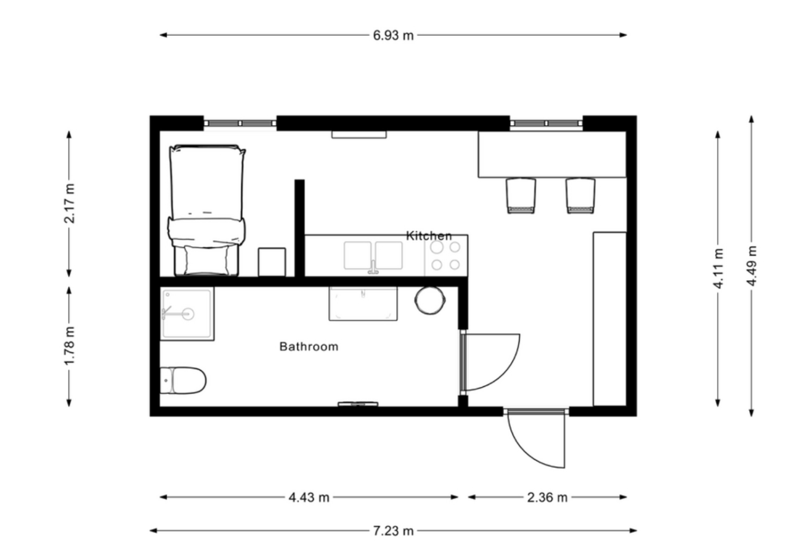

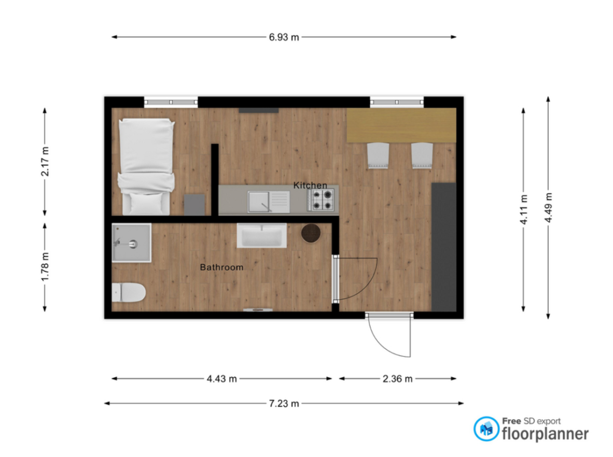

_Figure 1. The studied building and its dimensions with an assumed ceiling height of 2,4 meters. _

# 

# **II_Thermal and mathematical model**

## **1.Composition of the walls**

A heat flow could be described as a flow of energy due to variances in temperature between two positions, and it can occur in the form of conduction, convection, radiation as well as advection, similar to the case presented in figure 3. 

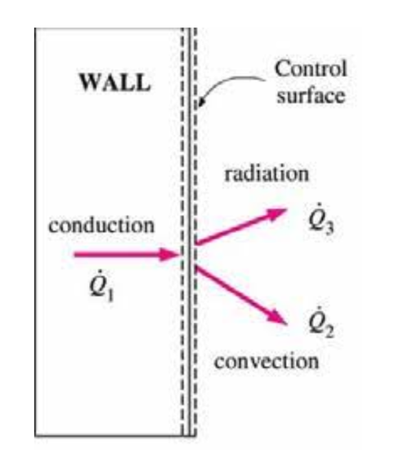

_Figure 3. Heat exchange through a wall in the form of conduction, convection and radiation. Advection is not presented in the figure but can be described as a heat flow due to a mass transfer mechanism. _

In this studied case, the walls are considered to consist of several layers of materials influencing the heat flow and therefore the internal temperature in the building. For example, the exterior wall is considered to consist of both concrete and insulation as presented in figure 4. 

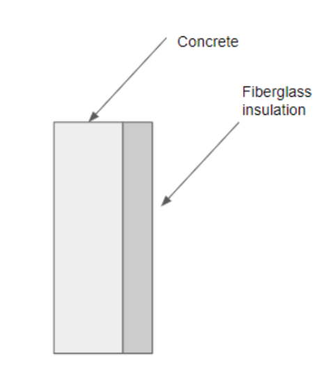

_Figure 4. The exterior wall is considered to consist of concrete and fiberglass insulation. _

The walls of this room aren’t all the same : 

* the wall of the main-room with the kitchen to the outside (wall 1)

    & to the corridor (wall 4) : concrete + insulation

* the wall of the main-room with the kitchen to the bathroom (wall 2) : concrete + wood
* the wall of the bathroom to the corridor (wall 3): concrete + wood

All the doors are in wood, and we consider the windows to be in glass. 

## **2. Parameters**

_Table 1. Description of the materials used in the building model regarding thickness, heat transfer coefficient, density as well as specific heat capacity. _

<table>
  <tr>
   <td><strong>Material</strong>
   </td>
   <td><strong>Thickness [mm]</strong>
   </td>
   <td><strong>Lambda [W/m/K]</strong>
   </td>
   <td><strong>Density [kg/m3]</strong>
   </td>
   <td><strong>Specific heat capacity [J/kgK] </strong>
   </td>
  </tr>
  <tr>
   <td>Air
   </td>
   <td>-
   </td>
   <td>0,0244
   </td>
   <td>1,208
   </td>
   <td>1006
   </td>
  </tr>
  <tr>
   <td>Concrete
   </td>
   <td>130
   </td>
   <td>1,8
   </td>
   <td>2300
   </td>
   <td>880
   </td>
  </tr>
  <tr>
   <td>Insulation 
   </td>
   <td>100
   </td>
   <td>0,0345
   </td>
   <td>22
   </td>
   <td>850
   </td>
  </tr>
  <tr>
   <td>Glass
   </td>
   <td>20
   </td>
   <td>1,4
   </td>
   <td>2210
   </td>
   <td>730
   </td>
  </tr>
  <tr>
   <td>Wood
   </td>
   <td>20
   </td>
   <td>0,15
   </td>
   <td>532
   </td>
   <td>2700
   </td>
  </tr>
</table>

_Table 2. Description of the surfaces regarding the building model components. _

<table>
  <tr>
   <td><strong>Part of building</strong>
   </td>
   <td><strong>Surface [m2]</strong>

<strong>We chose a height of 2,40m</strong>
   </td>
  </tr>
  <tr>
   <td>Wall 1 (Exterior wall)
   </td>
   <td>13,6
   </td>
  </tr>
  <tr>
   <td>Wall 2 (Bathroom outer walls)
   </td>
   <td>14,9
   </td>
  </tr>
  <tr>
   <td>Wall 3 (Hallway to corridor) 
   </td>
   <td>5,7
   </td>
  </tr>
  <tr>
   <td>Wall 4 (Bathroom to corridor)
   </td>
   <td>10,6
   </td>
  </tr>
  <tr>
   <td>Windows 
   </td>
   <td>3
   </td>
  </tr>
  <tr>
   <td>Door
   </td>
   <td>2,1
   </td>
  </tr>
</table>

## **3.Thermal model of the room**

Below, in figure 5, the thermal modeling of the room is presented. The model is based on the heat flows which take place in the building plan described in figure 1. Further, the model consists of different types of components including branches, nodes and external heat sources representing how the heat flows through, for example, walls and windows.  

 

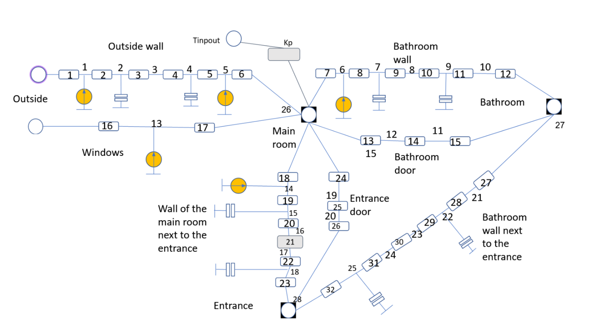

_Figure 5. The thermal model of the studied system based on the presented model in figure 1. The nodes and resistances were numbered appropriately and utilized to determine the matrices for the model to be adopted. _

Inner nodes of each wall material and each room has the following** heat capacity**:

**C = ρ. c. e. S.**

where:

* ρ is the density of the different materials ( kg/m3)
* c is the specific heat mass (J/kg/K)
* S is the surface of the wall (m2)
* e is the thickness of the wall (m)

For the **convective resistances**, they could be described by the formula

**R =1/(h.S)**

where:

* h is the thermal convection coefficient (W/m2/K) 

The values of **conduction resistance** are** R =e/(λ.S)**

where:

* λ is the thermal conductivity of the wall part (W/m/K)

## **4. Code implementation**

The construction of the thermal model requires the different principles of thermodynamics:

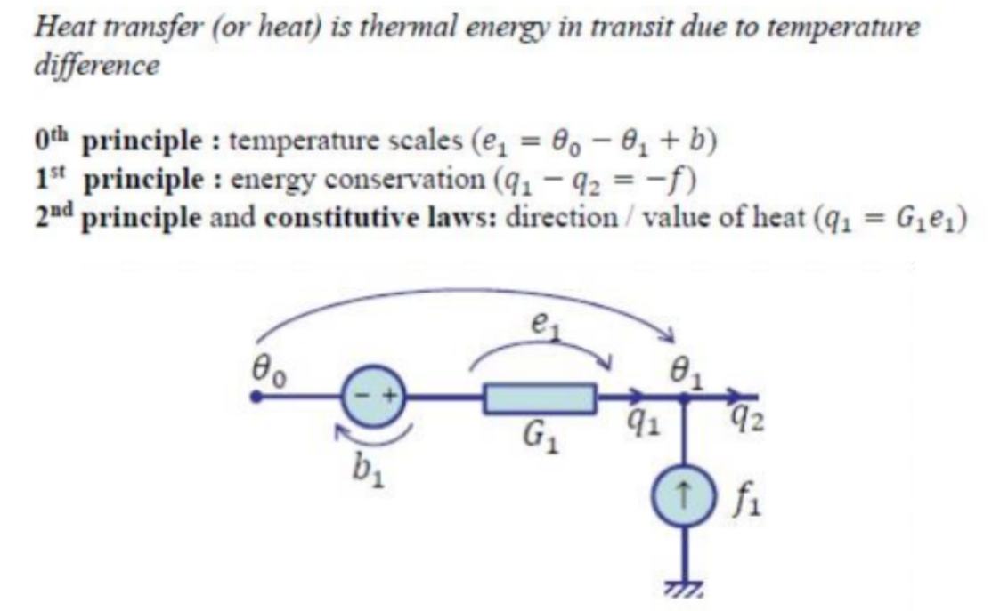

We have the following three equations:

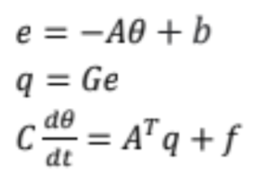

where e is the vector of temperature differences between two nodes, and

where q is the vector of heat flow through each resistor.

The three equations above combined lead us to the following differential equation, which governs the system :

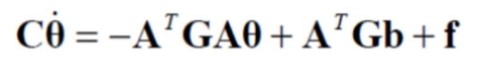

## 

## **5. Matrix A, C and G**

For our model, we have 28 temperature nodes and 33 heat flows (we consider the controller Kp in it) . Therefore, the matrices and the vectors that will be created will depend on this number of nodes and flows.

    We have then:

* the matrix **A** (33x28) which relates the temperatures between the nodes (composed of 1 for incoming flows to the node, -1 for an outgoing flow, and the rest is made of 0).
* the vector **b** (33x1) which relates the temperature sources
* the vector **f** (28x1), the vector of the flux sources
* the matrix **C** (28x28) for the thermal capacities
* the **G** matrix (33x33) for the conductances
* finally, the vector **Ө** (28x1) which concerns the temperatures at each node

**About the matrix A :**

(The matrix A is very big so here is a reconstruction of what we obtained with the code)

A = zeros (33,28)

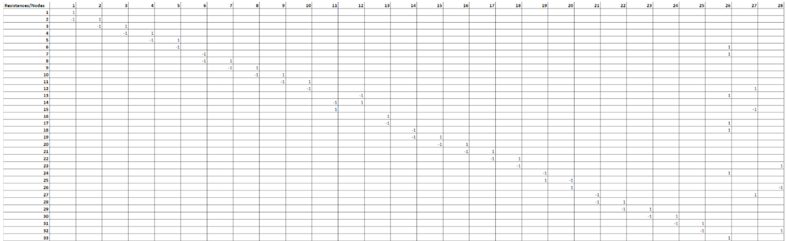

**About the G matrix :**

You can see in **Annexe 2** the exact calculations, so the exact components of the matrix wrote down : 

We used : 

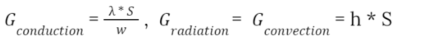

Where λ is the conductivity of the material (as defined in Table 1), S is the surface through which the heat flux is transmitted, w is the thickness of the wall layer (or slice of it), h is the convection coefficient or the equivalent radiative coefficient

G = diag (g)

with g :** **

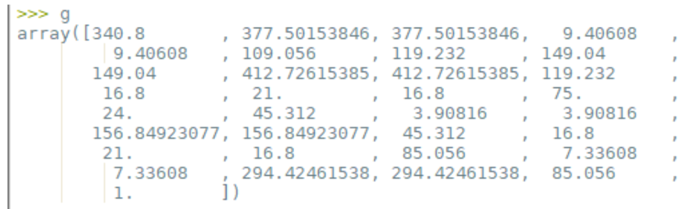

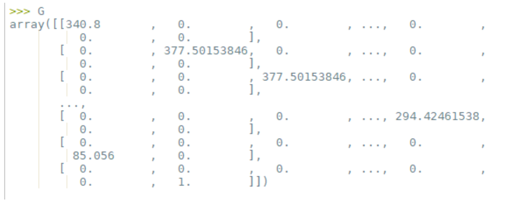

**About the matrix C :**

You can see in **Annexe 3** the exact calculations, so the exact components of the matrix wrote down : 

As said before, we used the formula : **C = ρ. c. e. S.**

The C matrix is very big.

So here is only the c matrix, with C =diag(c)

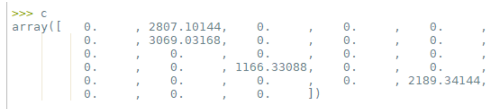

For the simulation, we erased all the low conductances. 

## **6. Vectors b and f in time**

The vector of temperature sources is b. It has the size of the number of branches and if its element is corresponding to a branch without a source is zero. If the flow in a source is from low potential to high potential (i.e. from - to +), the source is positive

Here we have constraints on the model which are temperatures sources : 

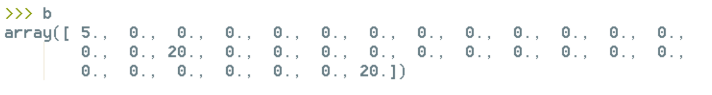

The vector **f** (28x1), the vector of the flux sources : 

f[1,1] = 1 (corresponds to the** outdoor** radiative flow rate)

f[5,1] = 1 (corresponds to the **indoor** radiative flow rate)

f[6,1] = 1 (corresponds to the **indoor** radiative flow rate)

f[13,1] = 1 (corresponds to the **absorbed** radiative flow rate)

f[14,1] = 1 (corresponds to the** indoor** radiative flow rate)

Regarding the radiation : 

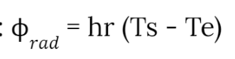

We will use : 1000 W/m2 K and 500 W/m2 K values for our simulation. 

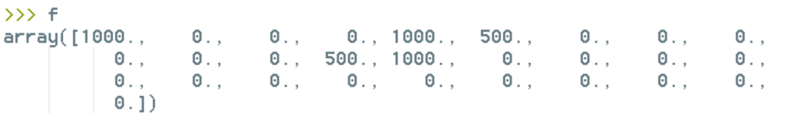

# 

# **III_Simulation**

## **1.Steady-state**

We will use :  hout = air convection coefficient = 25 & hin = 8 

For all the simulations we perform, it is necessary to go through a state representation of the system. The transition from thermal matrix modelling to the state representation corresponds to the transition between this equation :

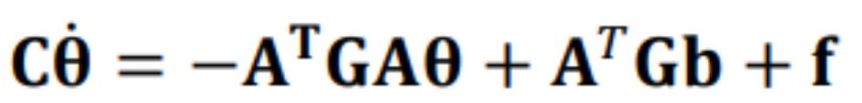

and the state space model : 

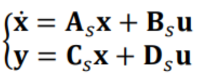

where:

𝐱 - the state vector: temperature nodes with capacities;

𝐲 - output vector: temperatures in the nodes of interest;

𝐮 - input vector: temperature and flow-rate sources;

𝐀𝑠 - state matrix;

𝐁𝑠 - input matrix;

𝐂𝑠 - output matrix;

𝐃𝑠 - feedthrough matrix.

The input vector u is : 

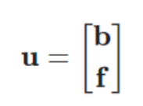

This transformation is achieved with the fTC2SS function by coding as follows : [As,Bs,Cs,Ds] = fTC2SS(A,G,b,C,f,y)

For this simulation we consider an initial temperature of 20°C in the main room, an outside temperature of 5°C. In addition, we consider that there is no heating system in operation and that the solar radiant flux is zero.

We obtain the following values : 

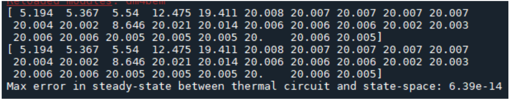

## **2. Steady -state : step response**

We simulate a step response using the following vector: 

b[[0, 15, 32]] = 0 + np.array([1, 1, 20]

It means that the outside temperature is 1°C, the initial temperature of the main room is 20°C and we use a controller to have the temperature of the main room to 1°C. 

The temperature shown is from the main room. It goes from 20°C to 1°C. 

# **3 _ Dynamic model**

In dynamic simulation, the inputs vary in time. Let's indicate the sources in the circuit by ones.

Let's consider that the output of the circuit is the indoor temperature. 

The state-space representation is obtained from the differential-algebraic equations of the thermal circuit :

[As, Bs, Cs, Ds] = dm4bem.tc2ss(A, G, b, C, f, y)

The maximum time step for numerical stability of Euler explicit integration in time is given by the minimum eigenvalue lambda of the state matrix As : 

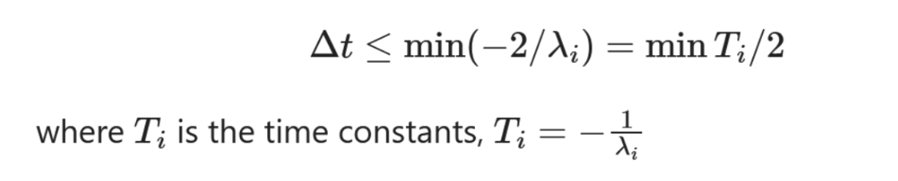

 : 

The maximum time step for numerical stability of Euler explicit integration in time depends on the value of the P-controller gain and if the capacities of the indoor air and window glass are taken into account.

**We obtain a maximum time step of 30,61 sec.**

**Let’s look at the step response :**

For the input vector u, the outdoor temperatures will be To = 1, the indoor set-point temperature will be Tsp = 0, and the heat flow sources will be zero.

The vectors for the evolution of temperatures (states) in time for Euler explicit and implicit are:

temp_exp **=** np**.**zeros([n_tC, t**.**shape[0]])

temp_imp **=** np**.**zeros([n_tC, t**.**shape[0]])

By integrating the state space model : 

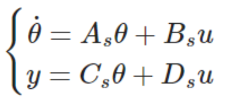

by using Euler forward (or explicit) : 

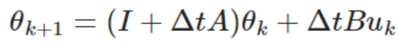

and Euler backward (or implicit) integration : 

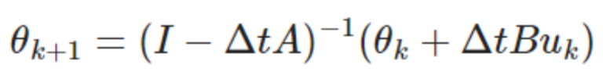

we obtain the outputs.

**The obtained curves are presented at the following page:**

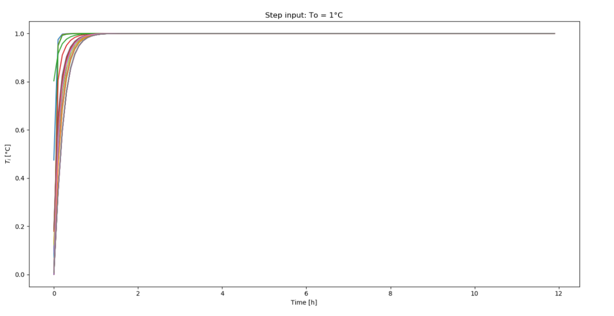

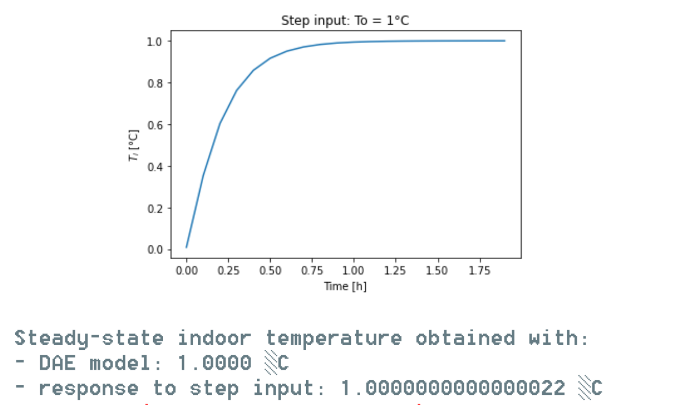

## **4.Simulation with weather data**

We didn’t succeed at simulating this part. 

There is a problem when we use y_exp et y_imp. 
These fonctions diverge a lot, it is why it is not working. 
We did not suceed to resolve this problem. 

We were able to plot only the outdoor temperatures. 

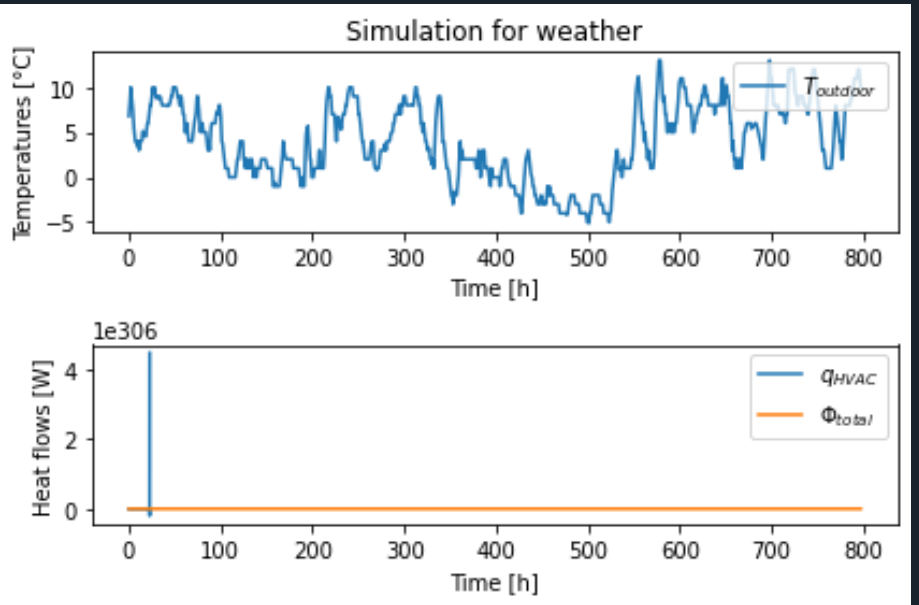

We could have seen the impact of radiation on the indoor temperature. 

# **Conclusion**

It is crucial to analyse the heat flow in a building to be able to enable energy management and optimise the energy consumption of the building. By creating a model of a building and considering heat flows in the form of conduction, convection and radiation in both steady state and dynamic conditions, this can be accomplished. In this project, we were able to develop a coherent thermal model of a building and verify the relevance of our modelling choices through simulations. The obtained results are consistent for both the static and the dynamic model, but it can be seen that the obtained time step of about 30 seconds regarding the dynamic model, is relatively small. This implies that the simulation possibly could be improved. 

Further, a controller was implemented which modelised a HVAC model capable of heating and cooling. Regarding this, it could be seen that the time step depends on Kp affecting the performance of the controller. When Kp goes towards the infinity, the controller becomes more idealised and when the value of Kp goes towards zero, the controller becomes less efficient. 

# 

# References 

L. Pérez-Lombard, J. Ortiz, C. Pout (2007). _A review on buildings energy consumption information_. Energy and Buildings, Vol. 40, Iss. 3, p. 394-398. Available at: [https://www.sciencedirect.com/science/article/pii/S0378778807001016](https://www.sciencedirect.com/science/article/pii/S0378778807001016) [2022-04-22] 

Annexe 1 : Precise table about the composition of the walls

<table>
  <tr>
   <td><strong>Material</strong>
   </td>
   <td><strong>Thickness [mm]</strong>

<strong>Width (w)</strong>
   </td>
   <td><strong>Lambda [W/mK]</strong>

>>>>>  gd2md-html alert: equation: use MathJax/LaTeX if your publishing platform supports it.  (<a href="#">Back to top</a>)(<a href="#gdcalert36">Next alert</a>) >>>>> 

   </td>
   <td><strong>Density [kg/m3]</strong>

>>>>>  gd2md-html alert: equation: use MathJax/LaTeX if your publishing platform supports it.  (<a href="#">Back to top</a>)(<a href="#gdcalert37">Next alert</a>) >>>>> 

   </td>
   <td><strong>Specific heat capacity [J/kgK]</strong>

<strong>c</strong>
   </td>
   <td>Surface in m2

(height of 2,40 m )
   </td>
  </tr>
  <tr>
   <td>Air
   </td>
   <td>-
   </td>
   <td>0.0244
   </td>
   <td>1.208
   </td>
   <td>1006
   </td>
   <td>-
   </td>
  </tr>
  <tr>
   <td>Concrete 1
   </td>
   <td>130
   </td>
   <td>1.8
   </td>
   <td>2300
   </td>
   <td>880
   </td>
   <td>6.93*2.40-g=13.632
   </td>
  </tr>
  <tr>
   <td>Concrete 2
   </td>
   <td>130
   </td>
   <td>1.8
   </td>
   <td>2300
   </td>
   <td>880
   </td>
   <td>2.4*(4.43+1.78)=14.904
   </td>
  </tr>
  <tr>
   <td>Concrete 3
   </td>
   <td>130
   </td>
   <td>1.8
   </td>
   <td>2300
   </td>
   <td>880
   </td>
   <td>2.36*2.4=5.664
   </td>
  </tr>
  <tr>
   <td>Concrete 4
   </td>
   <td>130
   </td>
   <td>1.8
   </td>
   <td>2300
   </td>
   <td>880
   </td>
   <td>4.43*2.4=10.632
   </td>
  </tr>
  <tr>
   <td>Insulation 1
   </td>
   <td>100
   </td>
   <td>0.0345
   </td>
   <td>22
   </td>
   <td>850
   </td>
   <td>6.93*2.4-g=13.632
   </td>
  </tr>
  <tr>
   <td>Insulation 3
   </td>
   <td>100
   </td>
   <td>0.0345
   </td>
   <td>22
   </td>
   <td>850
   </td>
   <td>2.36*2.4=5.664
   </td>
  </tr>
  <tr>
   <td>Insulation 4
   </td>
   <td>100
   </td>
   <td>0.0345
   </td>
   <td>22
   </td>
   <td>850
   </td>
   <td>4.43*2.4=10.632
   </td>
  </tr>
  <tr>
   <td>Glass 
   </td>
   <td>20 
   </td>
   <td>1.4
   </td>
   <td>2210
   </td>
   <td>730
   </td>
   <td>2*1.5=3
   </td>
  </tr>
  <tr>
   <td>Wood 2
   </td>
   <td>20
   </td>
   <td>0.15
   </td>
   <td>532
   </td>
   <td>2700
   </td>
   <td>2.4*(4.43+1.78)=14.904
   </td>
  </tr>
  <tr>
   <td>Wood door bathroom
   </td>
   <td>20
   </td>
   <td>0.15
   </td>
   <td>532
   </td>
   <td>2700
   </td>
   <td>2.10*1=2.1
   </td>
  </tr>
  <tr>
   <td>Wood door corridor 
   </td>
   <td>20
   </td>
   <td>0.15
   </td>
   <td>532
   </td>
   <td>2700
   </td>
   <td>2.10*1=2.1
   </td>
  </tr>
</table>

Annexe 2 : Construction of the g matrix

<table>
  <tr>
   <td>About the construction of the matrix g
   </td>
  </tr>
  <tr>
   <td>g=zeros(32,1)

Exterior wall : 

g(1,1) = ho * S_concrete1

g(2,1) = 2*_concrete * S_concrete1 / w_concrete

g(3,1) = 2*_concrete * S_concrete1 / w_concrete

g(4,1) = 2*_insulation * S_insulation1 / w_insulation

g(5,1) = 2*_insulation * S_insulation1 / w_insulation

g(6,1) = hin * S_insulation1

Wall main door - bathroom : 

g(7,1) = hin * S_wood2

g(8,1) = 2*_wood * S_wood2 / w_wood

g(9,1) = 2*_wood * S_wood2 / w_wood

g(10,1) = 2*_concrete * S_concrete2 / w_concrete

g(11,1) = 2*_concrete * S_concrete2 / w_concrete

g(12,1) = hin * S_concrete2

Door bathroom : 

g(13,1) = hin * S_doorbathroom

g(14,1) = 2*_wood * S_doorbathroom / w_wood

g(15,1) = hin * S_doorbathroom

Windows : 

g(16,1) = hout * S_windows

g(17,1) = hint * S_windows

Wall main room - corridor : 

g(18,1) = hin * S_insulation3

g(19,1) = 2*_insulation * S_insulation3 / w_insulation

g(20,1) = 2*_insulation * S_insulation3 / w_insulation

g(21,1) = 2*_concrete * S_concrete3 / w_concrete

g(22,1) = 2*_concrete * S_concrete3 / w_concrete

g(23,1) = hin * S_concrete3

Door main room - corridor : 

g(24,1) = hin * S_doorcorridor

g(25,1) = 2*_wood * S_doorcorridor / w_wood

g(26,1) = hin * S_doorcorridor

Wall bathroom - corridor : 

g(27,1) = hin * S_insulation4

g(28,1) = 2*_insulation * S_insulation4 / w_insulation

g(29,1) = 2*_insulation * S_insulation4 / w_insulation

g(30,1) = 2*_concrete * S_concrete4 / w_concrete

g(31,1) = 2*_concrete * S_concrete4 / w_concrete

g(32,1) = hin * S_concrete4
   </td>
  </tr>
</table>

Annexe 3 : Construction of the c matrix

<table>
  <tr>
   <td>About the construction of the matrix c
   </td>
  </tr>
  <tr>
   <td>c = zeros(28,1)

Exterior wall : (concrete and insulation)

S_concrete1 =S_insulation1

c(2,1) = c_concrete * S_concrete1 * w_concrete * _concrete

c(4,1) = c_insulation * S_insulation1 * w_insulation * _insulation 

Mur principal room to bathroom : 

S_concrete2 = S_wood2

c(7,1) = c_concrete * S_concrete2 * w_concrete * _concrete

c(10,1) = c_wood * S_wood2 * w_wood *  _wood

Mur principal room to corridor : 

S_concrete3 =S_insulation3

c(15,1) = c_insulation * S_insulation3 * w_insulation * _insulation

c(18,1) = c_concrete * S_concrete3 * w_concrete * _concrete

Mur bathroom to corridor : 

S_concrete4 =S_insulation4

c(22,1) = c_insulation * S_insulation4 * w_insulation * _insulation

c(25,1) = c_concrete * S_concrete4 * w_concrete * _concrete

C = diag(c)
   </td>
  </tr>
</table>

